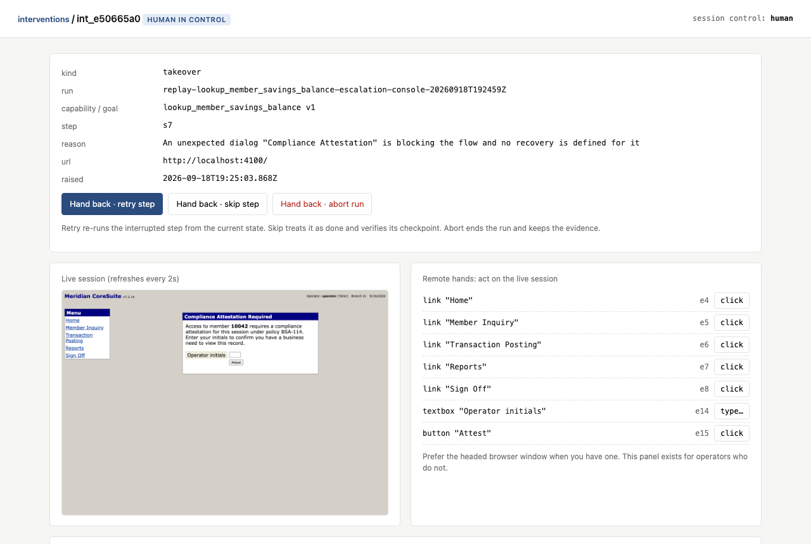
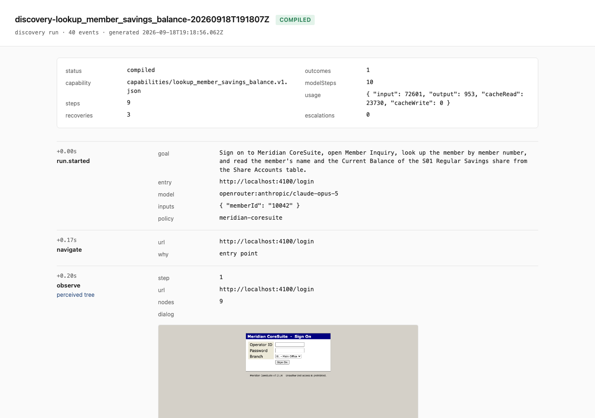
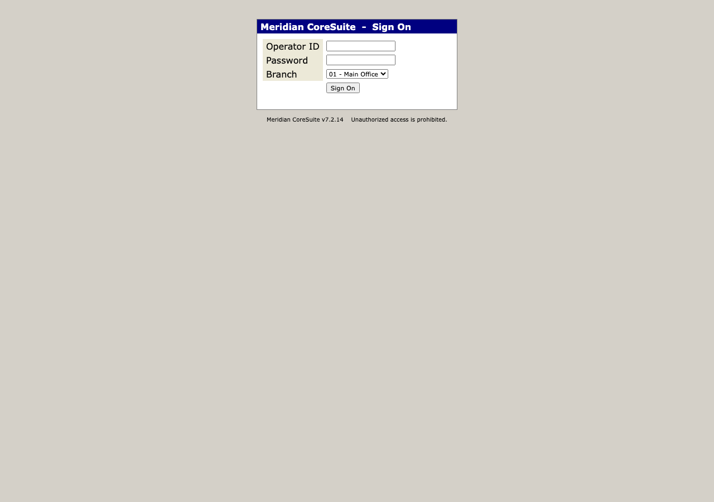

# hands

The layer that gives an AI agent hands inside software that has no API.

A model works out how to complete a task in a real UI once. The successful run is compiled into a typed, versioned **capability**: ordered steps, how each control is found, what proves each step took effect, typed inputs and outputs, the business outcomes it can end in, and the runtime conditions it knows how to clear. An agent then invokes that capability by name, and it replays deterministically with no model in the loop. When replay meets something it cannot safely handle, it pauses, hands the live browser session to a person, and resumes when they hand it back.

```
goal ─► discovery (a model drives the UI) ─► capability.json ─► replay (no model) ─► result
                                                                     │
                                       stuck? ─► operator takes the live session ─► hands back
```

The design write-up is in [REPORT.md](REPORT.md). Recorded runs, with logs and screenshots, are indexed in [evidence/README.md](evidence/README.md).

<table><tr>
<td width="50%"><br><sub>A replay hit a dialog it did not know. The operator took the live session, cleared it, and handed back.</sub></td>
<td width="50%"><br><sub>Every run writes a JSONL log, screenshots, the perceived tree, and this report.</sub></td>
</tr></table>

## What the recorded runs show

Two capabilities were discovered by Claude Opus 5 against the mock core and then replayed without a model:

- `lookup_member_savings_balance` (read only): discovered in 10 model turns, replayed for other members, for a member that does not exist (a `MEMBER_NOT_FOUND` outcome), through a session expiry and an application error (both recovered by restarting), against a core that answers every request 1.5 s late, through an unknown compliance dialog (escalated; an operator cleared it in the live session and handed back), and three times in a row for a stability check.
- `open_holiday_club_sub_account` (mutating): discovered in 16 model turns with one approval for the irreversible "Open Account" step, replayed with approval, with a deposit the core rejects (a `DEPOSIT_BELOW_MINIMUM` outcome), with the approval denied, and for a restricted member where a supervisor entered an override in the live session before the run continued.
- `bin/hands agent` let a model answer a two-part question by calling the first capability twice.

## What is in the box

| Path | What it is |
|---|---|
| `target/` | Meridian CoreSuite, a mock legacy credit-union core built for this project: frameset, table layout, no ids, native `confirm()`, session expiry, interstitials, a supervisor-gated function, and a fault endpoint. |
| `src/surface/` | Perception and action. An in-page walker builds an accessibility-style tree across frames; targets are derived from and resolved against that tree. Playwright drives the browser. |
| `src/schema/` | The capability artifact and the replay result contract (zod). |
| `src/discovery/` | Goal spec, the model planner (closed tool vocabulary, one action per turn), the observe/decide/act loop, and the compiler that turns a trace into a capability. |
| `src/replay/` | The deterministic engine: strategy-chain resolution, checkpoints, outcome / recovery / escalation detectors. |
| `src/policy/` | Allowlist, irreversible-action classification, redaction. |
| `src/session/` | Control lease, interventions, and the operator console. |
| `src/evidence/` | Structured run log, screenshots, HTML report. |
| `src/agent/` | Capabilities as tool definitions an agent can call. |
| `capabilities/` | The two saved artifacts, both approved. |
| `scripts/` | A scripted operator for demos and CI, and the evidence indexer. |
| `goals/`, `policies/` | The demo goal specs and the policy for the target. |

## Setup

Requires Node 22.9 or newer.

```sh
npm install
npx playwright install chromium
cp .env.example .env        # add a model key for discovery; replay never needs one
```

Discovery talks to Claude through one of two providers behind the same seam (`src/discovery/llm.ts`): the Anthropic API (`ANTHROPIC_API_KEY`) or OpenRouter (`OPENROUTER_API_KEY`, model `anthropic/claude-opus-5`). Whichever key is present is used; `HANDS_LLM` and `HANDS_MODEL` override. The recorded evidence was produced through OpenRouter.

`.env` is loaded by `bin/hands` through Node's own `--env-file-if-exists`. Nothing else reads it and it is git-ignored.

## Demo path

Start the target in one terminal:

```sh
npm run target               # Meridian CoreSuite on http://localhost:4100 (operator / meridian1)
```

Then, in another:

```sh
# 1. Discover: the model drives the UI to the goal. Uses the model key. The recorded runs cost well under a dollar each.
bin/hands discover goals/lookup_member_savings_balance.json --headed

# 2. Verify: replay the compiled capability with the discovery inputs, no model involved.
bin/hands verify lookup_member_savings_balance

# 3. Replay with other inputs. Outputs come back typed; a missing member is an outcome, not a crash.
bin/hands replay lookup_member_savings_balance --input memberId=10077
bin/hands replay lookup_member_savings_balance --input memberId=99999

# 4. Approve for unattended use, then invoke it the way an agent would.
bin/hands approve lookup_member_savings_balance
bin/hands invoke lookup_member_savings_balance --args '{"memberId":"20015"}'
```

Every run prints its evidence folder and the operator console URL (default `http://localhost:4700`). Open the console when a run says it is waiting on an intervention, or let a scripted operator stand in for you:

```sh
npx tsx scripts/operator.ts approve        # approve irreversible steps as they come up
npx tsx scripts/operator.ts attest         # clear the compliance dialog in the live session and hand back
npx tsx scripts/operator.ts supervisor --pin 2468
```

The script only talks to the console's JSON API, the same one the page uses.

### Seeing the runtime conditions

The target exposes `POST /__faults` (denied to the agent by policy) so the interesting conditions can be reproduced on demand:

```sh
curl -X POST localhost:4100/__faults -d '{"expireSession":true}'      # next request loses the session: recovery, restart
curl -X POST localhost:4100/__faults -d '{"appErrorOnce":true}'       # next page is an application error: recovery, restart
curl -X POST localhost:4100/__faults -d '{"complianceDialog":true}'   # an unknown dialog on member pages: escalation, takeover
curl -X POST localhost:4100/__faults -d '{"slowMs":1500}'             # every response 1.5 s late: waits are explicit, so it just takes longer
curl -X DELETE localhost:4100/__faults
```

Member `99999` does not exist (outcome). Member `40001` is restricted: opening a sub-account for them needs a supervisor override in the live session (escalation). An initial deposit under $5.00 is rejected by the core (outcome).

### The mutating capability

```sh
bin/hands discover goals/open_holiday_club_sub_account.json --headed
bin/hands verify open_holiday_club_sub_account
bin/hands replay open_holiday_club_sub_account --input memberId=10042 --input nickname=Trip --input initialDeposit=40.00
```

"Open Account" is classified irreversible by policy. Discovery and replay both pause for an approval in the operator console before pressing it; the `confirm()` it raises is answered as part of the step.

### The target itself



### Other commands

```sh
bin/hands catalog                 # what an agent can call, with contracts
bin/hands catalog --tools         # the same as tool definitions (JSON Schema)
bin/hands agent "What is the savings balance for member 10077?"   # a model picks a capability and calls it
bin/hands stability lookup_member_savings_balance --n 5
```

## Running without live services

`npm test` runs the whole thread against the mock core with a scripted planner standing in for the model and a scripted operator talking to the console's HTTP API: discovery, compilation, replay, outcomes, recoveries, the approval gate, a takeover, and the input and status gates. No key, no network, about two minutes.

```sh
npm test
npm run typecheck
scripts/record-evidence.sh       # regenerates every replay run under evidence/ from the saved capabilities
```

## Operating notes

- Secrets are referenced by name in artifacts (`{"kind":"secret","name":"MERIDIAN_PASSWORD"}`) and filled from the environment at run time. The redactor scrubs their values from every log, prompt, and screenshot caption.
- A capability is a `draft` until `verify` replays it successfully, and `approved` only when a person says so. Unattended replay refuses drafts.
- Evidence folders are self-contained: `events.jsonl`, `steps/*.png`, `snapshots/*.txt` (the perceived tree), `interventions/*.json`, `result.json`, and `report.html`.
